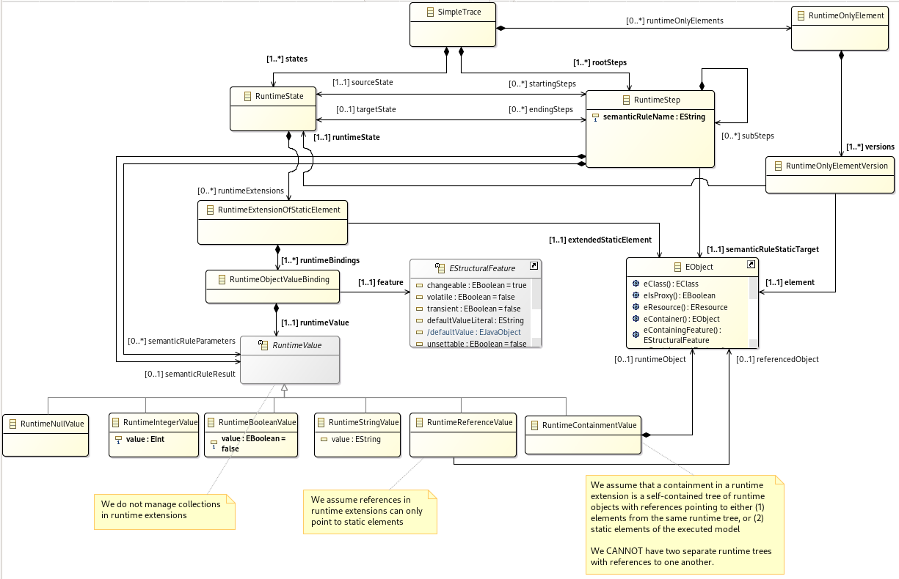

= Simpler traces for the GEMOC Studio

A first attempt at execution traces that are _not_ multidimensional.

This repository includes:

- A self-contained Ecore trace metamdoel (no dependencies on GEMOC Studio internal types),
- A GEMOC Execution Addon able to create execution traces conforming to this metamodel.

== Simple trace metamodel

